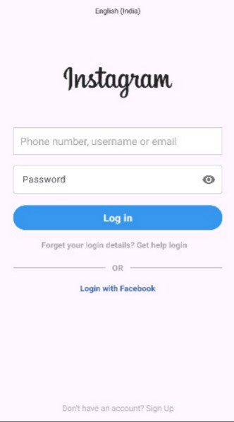

# Instagram Login UI (Android)

A simple Android application that replicates the **Instagram Login Screen UI** using **ConstraintLayout**, **Material Components**, and **Kotlin**.  
This project focuses on clean UI design, input validation, and basic screen navigation.

---

## 📱 Login Screen Preview

---

## 📱 Features

- Instagram-style login screen UI  
- Language selector text (UI only)  
- Username / Email / Phone input field  
- Password field with **show/hide toggle**  
- Login button with validation  
- “Forgot login details?” text  
- OR divider with horizontal lines  
- Login with Facebook option (UI only)  
- Navigation to Welcome screen after login  

---

## 🛠️ Tech Stack

- **Language:** Kotlin  
- **UI:** XML (ConstraintLayout)  
- **Material Components:** TextInputLayout  
- **IDE:** Android Studio  

---

## 👤 Author

**Bilal Nazeer**  

---

## 📄 License

This project is for **educational and practice purposes only**.
